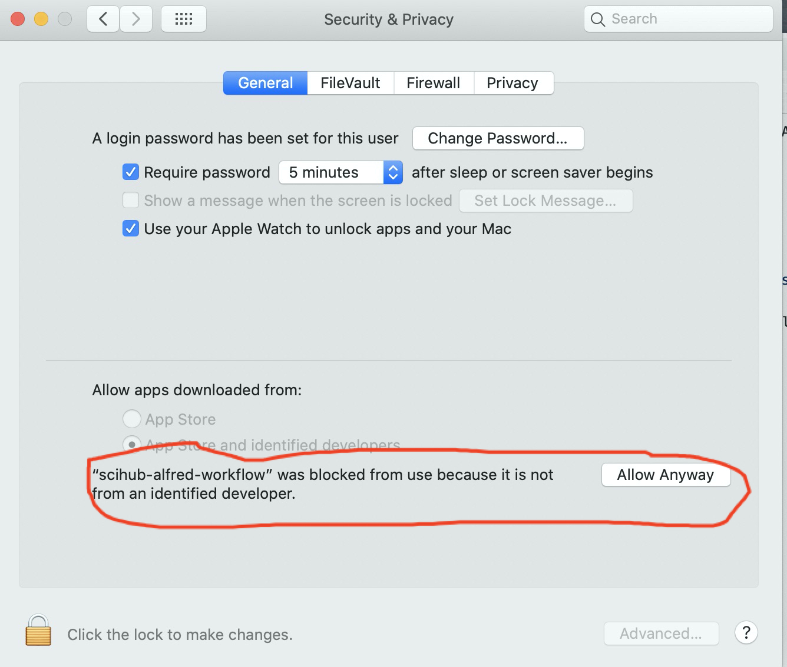

## About
a alfred workflow for downloading papers from SciHub
## Usage
keywords: papd + {DOI or URL}

The pdf  file of the paper will be downloaded into your Downloads directory. if CAPTCHA is needed, it will open  URL of the pdf file in your default browser.

## Installation

1. download [release](https://github.com/codechenx/scihub-alfred-workflow/releases/download/0.1/scihub-alfred-workflow-0.1.alfredworkflow)

2. After installation,  if macos warn you that "cannot be opened because the developer cannot be verified", then open system preferences -> security & privach -> click "allow anyway" like below:

