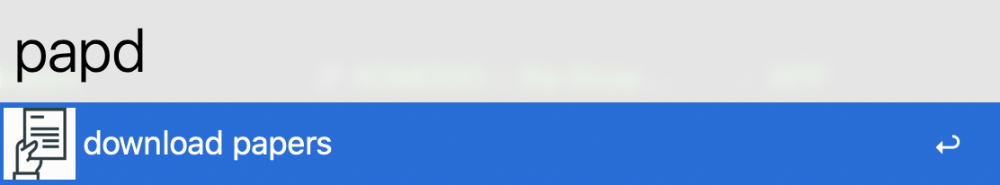

## About
a alfred workflow for downloading papers from SciHub
## Usage
keywords: papd {DOI or URL}

The pdf  file of the paper will be downloaded into your Downloads directory. if CAPTCHA is needed, it will open  URL of the pdf file in your default browser.

Because there are several seconds for alfred to download the pdf file of the paper, when you run this workflow, it will download the pdf file in background util it complete. And then your will receive a notification and can find this pdf file in your Downloads directory after.

## Installation

1. download [release](https://github.com/codechenx/scihub-alfred-workflow/releases/download/0.1.2/scihub_downlader_v0.1.2.alfredworkflow)

2. After installation,  if macos warn you that "cannot be opened because the developer cannot be verified", you need to open system preferences -> security & privach -> click "allow anyway" like below:

